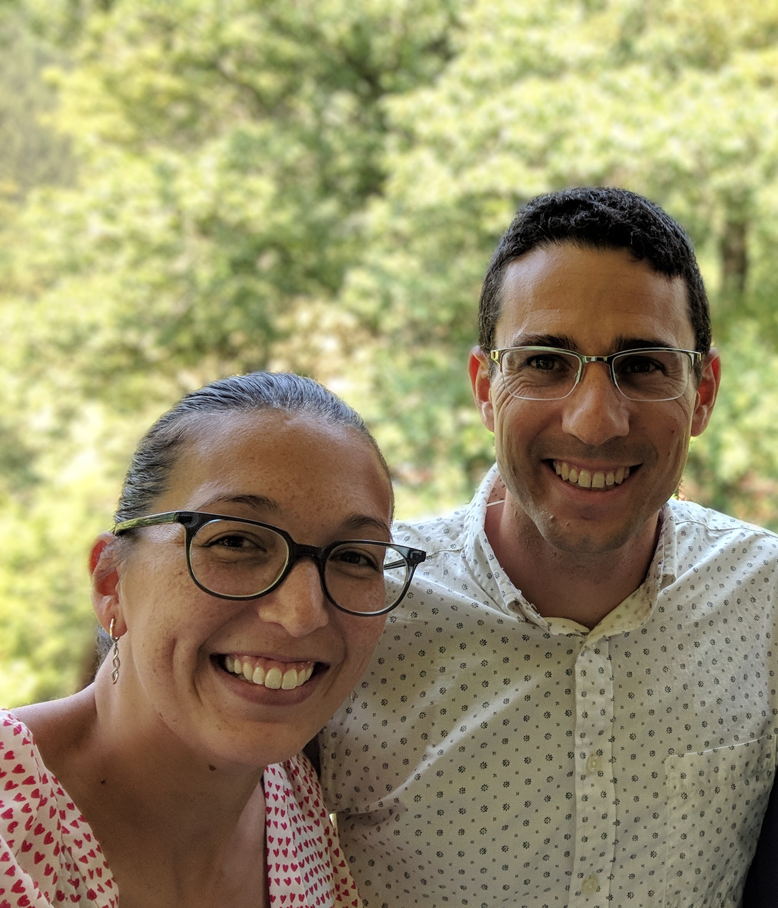

*Mathing with Dan and Bianca* gives a glimpse of what mathematics looks
like to working mathematicians.

## Your hosts
{.host-photo width="20"}
Dan and Bianca met the summer before starting grad school at the University of California, Berkeley in the prelim study class. They became study buddies and then office mates, and have been friends ever since. 

## Contact

Questions or comments? Reach us at
[mathing.podcast@gmail.com](mailto:mathing.podcast@gmail.com).
